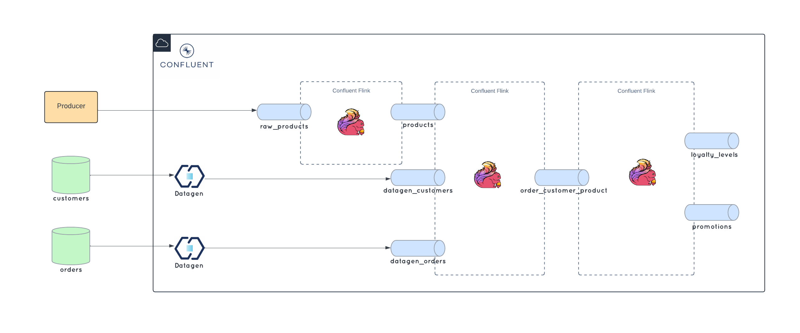

# Confluent Cloud - Flink SQL Workshop
Imagine you are on the loyalty team for a pizza store. You want to get an overview of sales, understand your customers better, and you'd like to get loyalty information to your customers and system in real-time and have the ability to add new promotions quickly!  Luckily, you already use Confluent Cloud as a backbone for your data. This means you can leverage Confluent Flink SQL for some ad-hoc analyses, determine loyatly levels and know which of your customers are currently eligible for a free items due to promotions!

For a good preparation and first understanding, please read this [Guide to Flink SQL: An In-Depth Exploration](https://www.confluent.io/blog/getting-started-with-apache-flink-sql/) . 
If you want a refresher of the Kafka basics, we highly recommend our [Kafka Fundamentals Workshop](https://www.confluent.io/resources/online-talk/fundamentals-workshop-apache-kafka-101/) .

In this workshop, we will build a Pizza Shop Loyalty Engine. We will use Flink SQL in Confluent Cloud on AWS. YOu can find an architecture diagram below.

## Required Confluent Cloud Resources 
The hands-on consists of a lab (see below), and these require Confluent Cloud infrastructure that has to be provisioned before we can start with the actual workshop. 

 *  Preparation of required Confluent Cloud Resources: You can either create your infrastructure manually with this [guide](prereq.md) or you can use Terraform for an automatated creation: [Terraform guide](terraform.md).

 *  The complete finished Hands-on can be created automatically with terraform as well. Please use this [guide](terraform-demo/README.md)

## Workshop Demo
  *  [Demo](demo.md): Join Statements, Data Enrichment, Statement Sets  

## Costs of this Confluent Cloud - Flink SQL Shoe Store Workshop
The lab execution do not consume much money. We calculated an amount of less than 10$ for a couple of hours of testing. If you create the cluster one day before, we recommend to pause all connectors.
