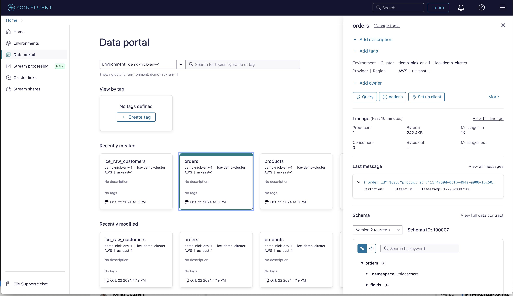

# Demo

All required resources in Confluent Cloud must be already created for this lab to work correctly. If you haven't already, please follow the [prerequisites](prereq.md).

## Content of Lab 1

[1. Verify Confluent Cloud Resources](demo.md#1-verify-confluent-cloud-resources)

[2. Connecting to Flink ](demo.md#2-connecting-to-flink)

[3. Data Transformation](demo.md#3-data-tranformation)

[4. Data Enrichment](demo.md#4-data-enrichment)

[5. Loyalty Level Calculations](demo.md#5-loyalty-level-calculations)

[6. Promotions Calcualations](demo.md#6-promotions-calculations)

[7. Closing](demo.md#7-closing)

## 1. Verify Confluent Cloud Resources
Let's verify if all resources were created correctly and we can start using them.

### Kafka Topics
Check if the following topics exist in your Kafka cluster:
 * lce_raw_products (for product data aka Product Catalog),
 * lce_raw_customers (for customer data aka Customer CRM),
 * orders (for realtime order transactions aka Order Processing System).

### Schemas in Schema Registry
Check if the following Avro schemas exist in your Schema Registry:
 * products-value,
 * customers-value,
 * orders-value.

NOTE: Schema Registry is at the Environment level and can be used for multiple Kafka clusters.

### Datagen Connectors
Your Kafka cluster should have two Datagen Source Connectors running. Check if their topic and template configurations match the table below.

| Connector Name (can be anything)     |      Topic(s)      | Format 
|--------------------------------------|:---------------:|-------:|
| **dyanmodb_source** | lce_raw_customers, lce_raw_products | JSON | 
| **order_source**    |   orders   | AVRO | 

## 2. Connecting to Flink 
You can use your web browser or console to enter Flink SQL statements.
  * **Web UI** - from the Home page click on the `Stream Processing` on the left side navigation
    Select your workspace or click button 'Create workspace' to create a new one

  * **Console** - copy/paste the command from your Flink Compute Pool to the command line.    
  Of course you could also use the the Flink SQL Shell. For this, you need to have Confluent Cloud Console tool installed and be logged in with correct access rights.
  Copy the command out of the Compute Pool Window and execute it in your terminal (we prefer iterm2). 
  ```bash
  confluent flink shell --compute-pool <pool id> --environment <env-id>
  ```

NOTE: You can also access your Flink Compute Pool from the Data Portal as shown below. Just click on `Data Portal` in the main menu on the left side. Then select your Environment. You should see your topics. When you click on any of the topic tiles you can query the topic's data using Flink. 

Data Portal: `orders` topic selected. Click on `Query` button to access your Flink Compute Pool.


## 3. Data Transformation
Our customer and product data is coming in from DynamoDB by way of a CDC connector.  Look at the product data. (Data Portal or Flink Statement)

```
SELECT * FROM lce_raw_products;
```

We can clean this up with Flink.

```
SELECT 
  CAST(JSON_VALUE(product_json, '$.id.S') as BYTES) as key,
  JSON_VALUE(product_json, '$.id.S') as id,
  JSON_VALUE(product_json, '$.name.S') as name,
  CAST(JSON_VALUE(product_json, '$.sale_price.N') as INT) as sale_price,
  CAST(JSON_VALUE(product_json, '$.rating.N') as DOUBLE) as rating
FROM 
  (  
     SELECT 
         JSON_VALUE(JSON_STRING(after), '$.document') as product_json 
     FROM `lce_raw_products`
  );
```

Verify the data looks right, then we will push it to a new table and topic!

```
INSERT INTO `products`
SELECT 
  CAST(JSON_VALUE(product_json, '$.id.S') as BYTES) as key,
  JSON_VALUE(product_json, '$.id.S') as id,
  JSON_VALUE(product_json, '$.name.S') as name,
  CAST(JSON_VALUE(product_json, '$.sale_price.N') as INT) as sale_price,
  CAST(JSON_VALUE(product_json, '$.rating.N') as DOUBLE) as rating
FROM 
  (  
     SELECT 
         JSON_VALUE(JSON_STRING(after), '$.document') as product_json 
     FROM `lce_raw_products`
  );
```

Do the same for customers...

```
INSERT INTO `customers`
SELECT 
  CAST(JSON_VALUE(customer_json, '$.id.S') as BYTES) as key,
  JSON_VALUE(customer_json, '$.id.S') as id,
  JSON_VALUE(customer_json, '$.first_name.S') as first_name,
  JSON_VALUE(customer_json, '$.last_name.S') as last_name,
  JSON_VALUE(customer_json, '$.email.S') as email,
  JSON_VALUE(customer_json, '$.phone.S') as phone,
  JSON_VALUE(customer_json, '$.street_address.S') as address,
  JSON_VALUE(customer_json, '$.state.S') as state,
  JSON_VALUE(customer_json, '$.zip_code.S') as zip_code,
  JSON_VALUE(customer_json, '$.country.S') as country,
  JSON_VALUE(customer_json, '$.country_code.S') as country_code
FROM 
  (  
     SELECT 
         JSON_VALUE(JSON_STRING(after), '$.document') as customer_json 
     FROM `lce_raw_customers`
  );
```

Verify the data is making to to `products` and `customers` topics.

## 4. Data Enrichment
We will join data from: Order, Customer, Product tables together in a single SQL statement.

Create a new table for Order <-> Customer <-> Product join result:

```
CREATE TABLE order_customer_product(
  order_id INT,
  first_name STRING,
  last_name STRING,
  email STRING,
  name STRING,
  sale_price INT,
  rating DOUBLE
)WITH (
    'changelog.mode' = 'retract'
);
```

Insert joined data from 3 tables into the new table:

```
INSERT INTO order_customer_product(
  order_id,
  first_name,
  last_name,
  email,
  name,
  sale_price,
  rating)
SELECT
  o.order_id,
  c.first_name,
  c.last_name,
  c.email,
  p.name,
  p.sale_price,
  p.rating
FROM 
  orders o
  INNER JOIN customers c 
    ON o.customer_id = c.id
  INNER JOIN products p
    ON o.product_id = p.id;
```

Verify the data was joined successfully!

```
SELECT * FROM shoe_order_customer_product;
```

## 5. Loyalty Level Calculations
Now we are ready to calculate loyalty levels for our customers.

First let's see which loyalty levels are being calculated:

```
SELECT
  email,
  SUM(sale_price) AS total,
  CASE
    WHEN SUM(sale_price) > 20000 THEN 'GOLD'
    WHEN SUM(sale_price) > 7500 THEN 'SILVER'
    WHEN SUM(sale_price) > 1000 THEN 'BRONZE'
    ELSE 'CLIMBING'
  END AS rewards_level
FROM order_customer_product
GROUP BY email;
```
> NOTE:  You can adjust the dollar amounts depending how long you have been pushing order data.

That looks good!  Let's create the `loyalty_levels` table:

```
CREATE TABLE loyalty_levels(
  email STRING,
  total BIGINT,
  rewards_level STRING,
  PRIMARY KEY (email) NOT ENFORCED
);
```

And then fill it with data:

```
INSERT INTO loyalty_levels
SELECT
  email,
  SUM(sale_price) AS total,
  CASE
    WHEN SUM(sale_price) > 20000 THEN 'GOLD'
    WHEN SUM(sale_price) > 7500 THEN 'SILVER'
    WHEN SUM(sale_price) > 1000 THEN 'BRONZE'
    ELSE 'CLIMBING'
  END AS rewards_level
FROM order_customer_product
GROUP BY email;
```

Verify --

```
SELECT * FROM loyalty_levels;
```

## 6. Promotions Calcualations
Let's find out if some customers are eligible for special promotions.

Find which customer should receive a special promotion for their Nth order of the same item.
```
SELECT
   email,
   COUNT(*) AS total,
   (COUNT(*) % 10) AS sequence,
   (COUNT(*) % 10) = 0 AS next_one_free
 FROM order_customer_product
 WHERE name = 'Extramostbestest Cheese'
 GROUP BY email;
```

And we can find which customers have ordered both of these items, and ordered more than 5 times.
```
SELECT
     email,
     COLLECT(name) AS products,
     'Extramostbestest Pepperony Puff Bundle' AS promotion_name
  FROM order_customer_product
  WHERE name IN ('Pepperoni Crazy Puffs', 'Extramostbestest Pepperoni')
  GROUP BY email
  HAVING COUNT(DISTINCT name) = 2 AND COUNT(name) > 5;
```

Cool - now let's store these, so we can take action.  Create the `promotions` table:

```
CREATE TABLE promotions(
  email STRING,
  promotion_name STRING,
  PRIMARY KEY (email) NOT ENFORCED
);
```

And insert data:

```
INSERT INTO promotions
SELECT
     email,
     COLLECT(name) AS products,
     'Extramostbestest Pepperony Puff Bundle' AS promotion_name
  FROM order_customer_product
  WHERE name IN ('Pepperoni Crazy Puffs', 'Extramostbestest Pepperoni')
  GROUP BY email
  HAVING COUNT(DISTINCT name) = 2 AND COUNT(name) > 2;


INSERT INTO promotions
SELECT
   email,
   'Buy 2 Get Next Free Extramostbestest Cheese' AS promotion_name
FROM order_customer_product
WHERE name = 'Extramostbestest Cheese'
GROUP BY email
HAVING COUNT(*) % 2 = 0;
```

Explore the data:

```
SELECT * FROM promotions;
```

## 7. Closing

From here, you could have a service that comsumes from the promotions topic and sends an email, alerts in an app, kicks off a production process to send a mailer, etc.
 
Questions?