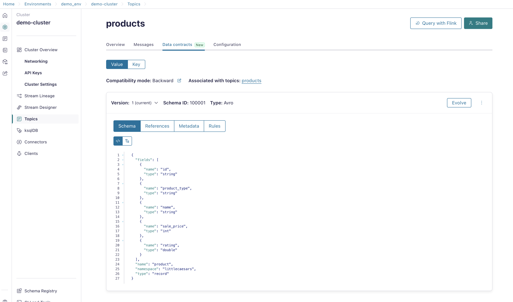

# Prerequisites
Before we can run the hands-on workshop, a working infrastructure in Confluent Cloud must exist:
- an environment with Schema Registry enabled
- a Kafka Cluster
- 3 topics
- events generated by our Sample Data Datagen Source connector


Now you have two possibilities to create the Hands-On Workshop Confluent Cloud resources:
1. Let terraform create it: If you are comfortable running terraform, then follow this [guide](terraform/README.md).  (This way is preffered)
2. Create all resources manually.

## Confluent Cloud Resources for the Hands-on Workshop: Manual Setup

Please be aware that the cluster and the Flink Pool need to be in the same Cloud-Provider-Region.

You can create each Confluent Cloud resource with the confluent cli tool and/or Confluent Cloud Control Plane GUI.
Both are using the confluent cloud API in background.
If you would like to use the cli, you need to [install the cli](https://docs.confluent.io/confluent-cli/current/install.html) on your desktop. This workshop guide will cover the GUI only.

### Create Environment and Schema Registry
Login into Confluent Cloud and create an environment with Schema Registry:
* Click `Add cloud environment`  button
* Enter a New environment name e.g. `demo-workshop` and push `create` button
* Choose Essentials Stream Governance package and click `Begin configuration`
        * Choose Preffered Cloud Provider and region.
        * Click button `Enable`


### Create Kafka Cluster in Environment `demo-env`

The next step is to create a Basic Cluster.
Click button `Create cluster` 
* choose BASIC `Begin configuration` button to start the cluster creation config.
* Choose your cloud provider and the region with Single zone and click `Continue`
* Give the cluster a name , e.g. `demo_cluster` and check rate card overview and configs, then press `Launch cluster` 


### Create topics in Kafka Cluster `demo_cluster`
Now, we need topics to store our events.
* raw_products
* products

Via the GUI the topic creation is very simple.
Create Topic by clicking (left.hand menu) Topics and then click `Create topic` button.
* Topic name : `raw_products`, Partitions : `6` and then click `Create with defaults` button.  You can skip adding a schema.
* Topic name : `products`, 
  * Click `Show Advanced Settings`
  * Under **Storage** change the cleanup policy to `compact`.  
  * **Save & Create** 

  * Then configure the schema for the topic message values
  * **Add Data Contract** 
  * Copy & Paste the schema from [products.avsc](./terraform/demo-infrastructure/schemas/avro/products.avsc)
  * **Create**

The screen should look similar to below:




### Create Sample Data connectors to fill the topics `datagen_customers` and `datagen_orders`
Confluent has the Datagen connector, which is a testdata generator. In Confluent Cloud a couple Quickstarts (predefinied data) are available and will generate data of a given format.
NOTE: We use Datagen with following templates:
* Shoe Customers https://github.com/confluentinc/kafka-connect-datagen/blob/master/src/main/resources/shoe_customers.avro
* Shoe Orders https://github.com/confluentinc/kafka-connect-datagen/blob/master/src/main/resources/shoe_orders.avro


Create two datagen connectors to fill the topics customers and orders, go to `Connectors` and click `Add Connector`. Pay attention when you select the template for the datagen connector and ensure, that it corresponds with the before selected topic as shown in the following. Deviations in this step will result in invalid queries at later stages in the workshop.
* Connector Plug-in `Sample Data`, Topic `datagen_customers`, Global Access amd Download API Key with Description `Datagen Connector Customers`, Format `AVRO`, template `Shoe customers`, 1 Task, Connector Name `customers_source` 
* Connector Plug-in `Sample Data`, Topic `datagen_orders`, Global Access amd Download API Key with Description `Datagen Connector Orders`, Format `AVRO`, template `Shoe orders`, 1 Task, Connector Name `orders_source` 

2 Connectors are up and running and are generating data for us.

What is really pretty cool, is that all these connectors are generating events in AVRO format and created automatically a schema for both topics.

You can have a look for the schema in the Schema Registry.

Or just use the topic viewer, where you can
- view the events flying in
- all meta data information
- configs
- and schemas as well

### Produce Sample Product Data
There is a [python script](./data/loadProducts.py) that will produce all the `product` [data](./data/product-data.json) to the `raw_products` topic.  Since you are not running the [terraform](./terraform/README.md) setup, we will have to create the API KEY by hand so that you can set the environment variables required for the script to run.

   1. Open the Confluent Cloud Console and navigate to "API keys"
   2. Select "+ Add API key"
   3. To keep things simple, select "My account" to create a key that has all of your access permissions
      1. NOTE: In production, you would create a service account with specific permissions and generate the key from that
   4. Select "Cloud resource management" for your resource scope, click "Next"
   5. Enter Name: "Producer API Key" and Description: "Used to produce product data", click "Create API key"  
   6. Click "Download API Key"
   7. Follow the directions in the python script to set the proper environment settings.
      1. Bootstrap URL can be found in the cluster settings for `demo-cluster`

```shell
python loadProducts.py
```

----

That's It - The preapration is finished. Well done!

The infrastructure for the Hands-on Workshop is up and running. And we can now start to develop our use case of a loyalty program in Flink SQL.

End of prerequisites, continue with [Workshop](./workshop/README.md).