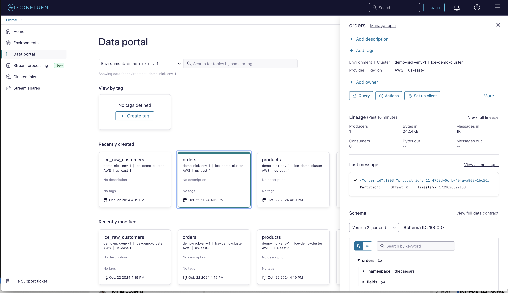

# Workshop

URL: https://confluent.cloud

Username: flinkdemo2024+lce[XXX]@gmail.com

Password: lceDemo2024#[XXX]

---

All required resources in Confluent Cloud must be already created for this lab to work correctly. If you haven't already, please follow the [prerequisites](prereq.md).

----

## Contents of the Lab
[1. Verify Confluent Cloud Resources](README.md#1-verify-confluent-cloud-resources)

[2. Connecting to Flink ](README.md#2-connecting-to-flink)

[3. Data Transformation](README.md#3-data-tranformation)

[4. Data Enrichment](README.md#4-data-enrichment)

[5. Loyalty Level Calculations](README.md#5-loyalty-level-calculations)

[6. Promotions Calcualations](README.md#6-promotions-calculations)

----

## 1. Verify Confluent Cloud Resources
Let's verify if all resources were created correctly and we can start using them.

### Kafka Topics
Check if the following topics exist in your Kafka cluster:
 * lce_raw_products (for product data aka Product Catalog),
 * lce_raw_customers (for customer data aka Customer CRM),
 * orders (for realtime order transactions aka Order Processing System).

### Schemas in Schema Registry
Check if the following Avro schemas exist in your Schema Registry:
 * products-value,
 * customers-value,
 * orders-value.

NOTE: Schema Registry is at the Environment level and can be used for multiple Kafka clusters.

### Datagen Connectors
Your Kafka cluster should have two Source Connectors.

| Connector Name (can be anything)     |      Topic(s)      | Format 
|--------------------------------------|:---------------:|-------:|
| **dyanmodb_source** | lce_raw_customers, lce_raw_products | JSON | 
| **order_source**    |   orders   | AVRO | 

## 2. Connecting to Flink 
You can use your web browser or console to enter Flink SQL statements.
  * **Web UI** - from the Home page click on the `Stream Processing` on the left side navigation
    Select your workspace or click button 'Create workspace' to create a new one

  * **Console** - copy/paste the command from your Flink Compute Pool to the command line.    
  Of course you could also use the the Flink SQL Shell. For this, you need to have Confluent Cloud Console tool installed and be logged in with correct access rights.
  Copy the command out of the Compute Pool Window and execute it in your terminal (we prefer iterm2). 
  ```bash
  confluent flink shell --compute-pool <pool id> --environment <env-id>
  ```

NOTE: You can also access your Flink Compute Pool from the Data Portal as shown below. Just click on `Data Portal` in the main menu on the left side. Then select your Environment. You should see your topics. When you click on any of the topic tiles you can query the topic's data using Flink. 

Data Portal: `orders` topic selected. Click on `Query` button to access your Flink Compute Pool.


## 3. Data Transformation
Our customer and product data is coming in from a source database by way of a CDC connector.  Look at the product data in the topic. (Data Portal or Flink Statement) 

```
SELECT * FROM lce_raw_products;
```

This obviously will not be easy to work with.  Let's leverage Flink to transform this raw format into our desired `Customer` and `Product` schema.

```
SELECT 
  CAST(JSON_VALUE(product_json, '$.id.S') as BYTES) as key,
  JSON_VALUE(product_json, '$.id.S') as id,
  JSON_VALUE(product_json, '$.name.S') as `name`,
  CAST(JSON_VALUE(product_json, '$.sale_price.N') as INT) as sale_price,
  CAST(JSON_VALUE(product_json, '$.rating.N') as DOUBLE) as rating
FROM 
  (  
     SELECT 
         JSON_VALUE(JSON_STRING(after), '$.document') as product_json 
     FROM `lce_raw_products`
  );
```

Verify the data looks right, then we will push it to a new table and topic! 

> [01-Product_Transformation.sql](01-Product_Transformation.sql)

Do the same for customers...

> [02-Customer_Transformation.sql](02-Customer_Transformation.sql)


Verify the data is making to to `customer` and `products` topics.


```
SELECT * FROM customer;
```

```
SELECT * FROM products;
```

## 4. Data Enrichment  
Now that we have those cleaned up, let's put them to use!  We will join data from: Order, Customer, Product tables together in a single SQL statement.

> [03-Order_Enrichment.sql](03-Order_Enrichment.sql)

Verify the data was joined successfully!

```
SELECT * FROM order_customer_product;
```

## 5. Loyalty Level Calculations
Now we are ready to calculate loyalty levels for our customers.  Your team has decided to create 4 levels of pizza shop loyalty.  GOLD, SILVER, BRONZE, and CLIMBING.  The levels will coincide to a customer's TOTAL SPEND in their lifetime as a customer.

Let's get a feel for the data (explore lifetime spends and purchase counts)

```
SELECT
  email,
  SUM(sale_price) AS total_spend
FROM order_customer_product
GROUP BY email;
```

Let's build our loyalty levels base on this data.

```
SELECT
  email,
  SUM(sale_price) AS total,
  CASE
    WHEN SUM(sale_price) > 100000 THEN 'GOLD'
    WHEN SUM(sale_price) > 50000 THEN 'SILVER'
    WHEN SUM(sale_price) > 10000 THEN 'BRONZE'
    ELSE 'CLIMBING'
  END AS rewards_level
FROM order_customer_product
GROUP BY email;
```
> NOTE:  You can adjust the dollar amounts depending how long you have been pushing order data.


That looks good!  Let's create and populate the `loyalty_levels` table:

> [04-Loyalty_Level_Calculations.sql](04-Loyalty_Level_Calculations.sql)


## 6. Promotions Calcualations
Promotions are great! Customers LOVE free stuff!  Let's build a few:

But first, let's build our `promotions` table:

> [05-Promotions_Table.sql](05-Promotions_Table.sql)


#### Promotion 1 - Buy 10, Get 1 FREE
People love to eat their favorite pizza, but you know what they love even more???  Getting their favorite pizza for FREE! Let's build a promotion that looks tells us when a customer reaches their 5th purchase!

Look into the data:

```
SELECT
   email,
   COUNT(*) AS total,
   (COUNT(*) % 5) AS sequence,
   (COUNT(*) % 5) = 0 AS next_one_free
 FROM order_customer_product
 WHERE name = 'Detroit-Style Deep Dish Ultimate Supreme'
 GROUP BY email;
```
> NOTE:  Order generation data is random.  You might need to select a different product or adjust your Buy amount a bit. 

Our promotion engine only needs to know the email and the name of the promotion.  It will look up the notification and verbage to send in another system.  So we don't need to have a customer's "journey" towards the promotion, just the ones that have activated the promotion.  We can do that!

> [06-Promo1.sql](06-Promo1.sql)

```
INSERT INTO promotions
SELECT
   email,
   'PROMO-BSGO-1' AS promotion_name
FROM order_customer_product
WHERE product_name = 'Detroit-Style Deep Dish Ultimate Supreme'
GROUP BY email
HAVING COUNT(*) % 5 = 0;
```

#### Promotion 2 - BUNDLE UP
Pepperoni, who doesn't want more?  Obviously, everyone WANTS more, but we want to reward the people who have shown that they LOVE Pepperoni.  Let's build a promotion for when customer has bought both the Extramostbestest Pepperoni Pizza and Pepperoni Crazy Puffs.  After more than 5 purchases of any of the two, they qualify!

```
INSERT INTO promotions
SELECT
     email,
     'PROMO-BUNDLE-1' AS promotion_name
  FROM order_customer_product
  WHERE product_name IN ('Pepperoni Crazy Puffs', 'Extramostbestest Pepperoni')
  GROUP BY email
  HAVING COUNT(DISTINCT product_name) = 2 AND COUNT(product_name) % 5 = 0;

```

Let's now look at what we have going on in the promotions table:

```
SELECT * FROM promotions;
```

#### Promotion 3 - ???
Think of something else?  Want to explore?  Let's do it!!
